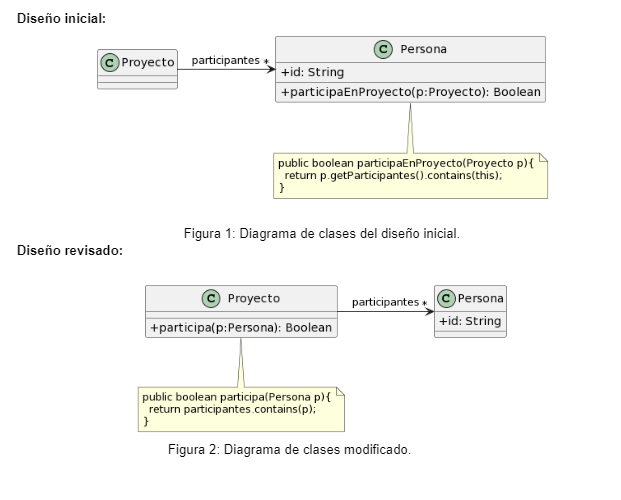

### 1.2 Participación en proyectos 
Al revisar el siguiente diseño inicial (Figura 1), se decidió realizar un cambio para evitar lo que se consideraba un mal olor. El diseño modificado se muestra en la Figura 2. Indique qué tipo de cambio se realizó y si lo considera apropiado. Justifique su respuesta.

**Code smells:**
1. Feature Envy
2. Data class

Los cambios que se realizaron fue que se delego a la clase **"Proyecto"** determinar si una persona participa o no en el, lo considero apropiado ya que es una solución con respecto a los malos olores _Feature Envy_ y _Data class_ que se encuentran en el diseño de la Figura 1, ya que en ese diseño la clase **"Proyecto"** esta actuando nada mas como una clase de datos y la clase **"Persona"** como una clase dios

