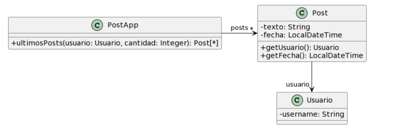
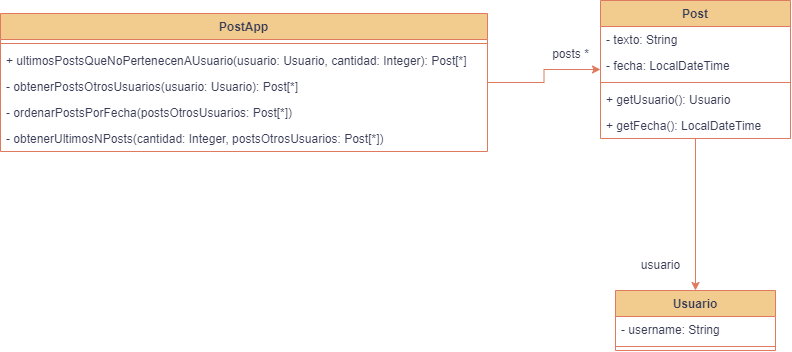
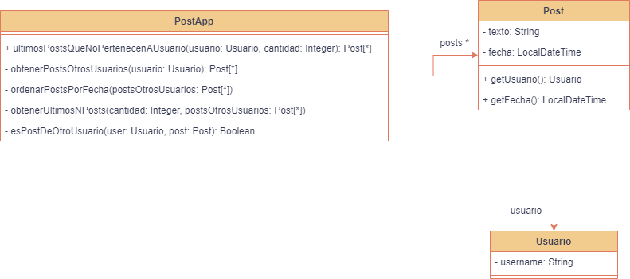
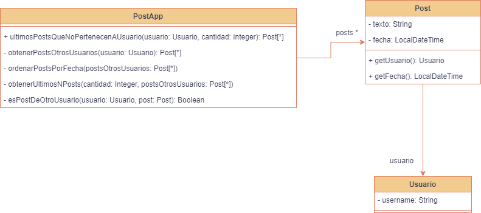

### 2.3 Publicaciones



```java

/**
* Retorna los últimos N posts que no pertenecen al usuario usuario
*/
public List<Post> ultimosPosts(Usuario usuario, int cantidad) {
        
    List<Post> postsOtrosUsuarios = new ArrayList<Post>();
    for (Post post : this.posts) {
        if (!post.getUsuario().equals(usuario)) {
            postsOtrosUsuarios.add(post);
        }
    }
        
   // ordena los posts por fecha
   for (int i = 0; i < postsOtrosUsuarios.size(); i++) {
       int masNuevo = i;
       for(int j= i +1; j < postsOtrosUsuarios.size(); j++) {
           if (postsOtrosUsuarios.get(j).getFecha().isAfter(
     postsOtrosUsuarios.get(masNuevo).getFecha())) {
              masNuevo = j;
           }    
       }
      Post unPost = postsOtrosUsuarios.set(i,postsOtrosUsuarios.get(masNuevo));
      postsOtrosUsuarios.set(masNuevo, unPost);    
   }
        
    List<Post> ultimosPosts = new ArrayList<Post>();
    int index = 0;
    Iterator<Post> postIterator = postsOtrosUsuarios.iterator();
    while (postIterator.hasNext() &&  index < cantidad) {
        ultimosPosts.add(postIterator.next());
    }
    return ultimosPosts;
}
```

1. **Mal Olor:** El metodo **ultimosPosts()** es muy largo y su nombre no es descriptivo.

2. **Refactoring:** Rename (a ultimosPosts) y Extract Method 
   1. Cree un nuevo método y asígnele un nombre que haga evidente su propósito.
   2. Copie el fragmento de código relevante en su nuevo método. Elimine el fragmento de su ubicación anterior y haga una llamada para el nuevo método allí.
   3. Encuentre todas las variables utilizadas en este fragmento de código. Si se declaran dentro del fragmento y no se usan fuera de él, simplemente déjelos sin cambios: se convertirán en variables locales para el nuevo método.
   4. Si las variables se declaran antes del código que está extrayendo, deberá pasar estas variables a los parámetros de su nuevo método para poder usar los valores contenidos previamente en ellos. A veces es más fácil deshacerse de estas variables recurriendo a Reemplazar temperatura con consulta.
   5. Si ve que una variable local cambia en su código extraído de alguna manera, esto puede significar que este valor modificado será necesario más adelante en su método principal. ¡Doble verificación! Y si este es el caso, devuelva el valor de esta variable al método principal para que todo siga funcionando.

3. **Resultado**:  



```java
public class PostApp {
	private List<Post> posts;

	public List<Post> ultimosPostsQueNoPertenecenAUsuario(Usuario usuario, int cantidad) {
        
	   List<Post> postsOtrosUsuarios = obtenerPostsOtrosUsuarios(usuario);
	   postsOtrosUsuarios = ordenarPostsPorFecha(postsOtrosUsuarios);
	   return obtenerUltimosNPosts(cantidad, postsOtrosUsuarios);
	}

	private List<Post> obtenerPostsOtrosUsuarios(Usuario usuario) {
		List<Post> postsOtrosUsuarios = new ArrayList<Post>();
	    for (Post post : this.posts) {
	        if (!post.getUsuario().equals(usuario)) {
	            postsOtrosUsuarios.add(post);
	        }
	    }
		return postsOtrosUsuarios;
	}

	private List<Post> ordenarPostsPorFecha(List<Post> postsOtrosUsuarios) {
		for (int i = 0; i < postsOtrosUsuarios.size(); i++) {
		       int masNuevo = i;
		       for(int j= i +1; j < postsOtrosUsuarios.size(); j++) {
		           if (postsOtrosUsuarios.get(j).getFecha().isAfter(
		     postsOtrosUsuarios.get(masNuevo).getFecha())) {
		              masNuevo = j;
		           }    
		       }
		      Post unPost = postsOtrosUsuarios.set(i,postsOtrosUsuarios.get(masNuevo));
		      postsOtrosUsuarios.set(masNuevo, unPost);    
		   }
		return postsOtrosUsuarios;
	}

	private List<Post> obtenerUltimosNPosts(int cantidad, List<Post> postsOtrosUsuarios) {
		List<Post> ultimosPosts = new ArrayList<Post>();
	    int index = 0;
	    Iterator<Post> postIterator = postsOtrosUsuarios.iterator();
	    while (postIterator.hasNext() &&  index < cantidad) {
	        ultimosPosts.add(postIterator.next());
	    }
	    return ultimosPosts;
	}

	
}
```

1. **Mal Olor**: Reinventar la rueda en vez de utilizar las herramientas que nos brinda el lenguaje. Esto sucede en el método **ordenarPostsPorFecha()** ya que se esta implementando un algoritmo de ordenamiento cuando podría usar **"stream()"**. También sucede en el método **obtenerUltimosNPosts()** ya que se esta implementando un algoritmo para obtener los ultimos que se podría hacer haciendo uso de **"stream()"**

2. **Refactoring**: Replace Loop with Pipeline
   1. Identificar el bucle existente: Localiza el bucle en tu código que realiza la iteración sobre una colección de elementos.
   2. Crear un Stream: Crea un Stream a partir de la colección de elementos utilizando el método stream() o parallelStream().
   3. Encadenar operaciones: Encadena las operaciones funcionales (filter, map, reduce, etc.) en el Stream. Estas operaciones representarán las transformaciones y filtrados que se aplicarán a los elementos del Stream.
   4. Reemplazar las operaciones del bucle: Examina el cuerpo del bucle y reemplaza las operaciones que se realizan en cada iteración con las correspondientes operaciones funcionales en el Stream.
   5. Ejecutar la tubería (pipeline): Utiliza un método terminal, como forEach, collect, reduce u otros, para ejecutar la tubería (pipeline) y obtener el resultado deseado.
   6. Validar y probar: Asegúrate de que el resultado de la tubería de operaciones sea equivalente al resultado original del bucle. Realiza pruebas exhaustivas para confirmar que el comportamiento sea el esperado.

3. **Resultado**:

```java
public class PostApp {
	private List<Post> posts;

	public List<Post> ultimosPostsQueNoPertenecenAUsuario(Usuario usuario, int cantidad) {
        
	   List<Post> postsOtrosUsuarios = obtenerPostsOtrosUsuarios(usuario);
	   postsOtrosUsuarios = ordenarPostsPorFecha(postsOtrosUsuarios);
	   return obtenerUltimosNPosts(cantidad, postsOtrosUsuarios);
	}

	private List<Post> obtenerPostsOtrosUsuarios(Usuario usuario) {
	    return this.posts.stream()
	            .filter(post -> !post.getUsuario().equals(usuario))
	            .collect(Collectors.toList());
	}

	private List<Post> ordenarPostsPorFecha(List<Post> postsOtrosUsuarios) {
		return postsOtrosUsuarios.stream().sorted((p1,p2) -> p1.getFecha().compareTo(p2.getFecha())).collect(Collectors.toList());
	}

	private List<Post> obtenerUltimosNPosts(int cantidad, List<Post> postsOtrosUsuarios) {
	    return postsOtrosUsuarios.stream()
	            .limit(cantidad)
	            .collect(Collectors.toList());
	}

	
}
```

1. **Mal Olor**: Responsabilidad mal asignada. El método **ultimosPostsQueNoPertenecenAUsuario()** la verificación de que el usuario no sea el dueño del post, cuando debería ser responsabilidad de la clase **"Post"**. (Feature Envy y Data Class) 

2.  **Refactoring**: Extract Method y Move Method

3.  **Resultado**:

**Extract Method**:



```java
public class PostApp {
	private List<Post> posts;

	public List<Post> ultimosPostsQueNoPertenecenAUsuario(Usuario usuario, int cantidad) {
        
	   List<Post> postsOtrosUsuarios = obtenerPostsOtrosUsuarios(usuario);
	   postsOtrosUsuarios = ordenarPostsPorFecha(postsOtrosUsuarios);
	   return obtenerUltimosNPosts(cantidad, postsOtrosUsuarios);
	}

	private List<Post> obtenerPostsOtrosUsuarios(Usuario usuario) {
	    return this.posts.stream()
	            .filter(post -> esPostDeOtroUsuario(usuario, post))
	            .collect(Collectors.toList());
	}

	private boolean esPostDeOtroUsuario(Usuario usuario, Post post) {
		return !post.getUsuario().equals(usuario);
	}

	private List<Post> ordenarPostsPorFecha(List<Post> postsOtrosUsuarios) {
		return postsOtrosUsuarios.stream().sorted((p1,p2) -> p1.getFecha().compareTo(p2.getFecha())).collect(Collectors.toList());
	}

	private List<Post> obtenerUltimosNPosts(int cantidad, List<Post> postsOtrosUsuarios) {
	    return postsOtrosUsuarios.stream()
	            .limit(cantidad)
	            .collect(Collectors.toList());
	}

	
}
```

**Move Method**:



```java
public class PostApp {
	private List<Post> posts;

	public List<Post> ultimosPostsQueNoPertenecenAUsuario(Usuario usuario, int cantidad) {
        
	   List<Post> postsOtrosUsuarios = obtenerPostsOtrosUsuarios(usuario);
	   postsOtrosUsuarios = ordenarPostsPorFecha(postsOtrosUsuarios);
	   return obtenerUltimosNPosts(cantidad, postsOtrosUsuarios);
	}

	private List<Post> obtenerPostsOtrosUsuarios(Usuario usuario) {
	    return this.posts.stream()
	            .filter(post -> post.esPostDeOtroUsuario(usuario))
	            .collect(Collectors.toList());
	}

	private List<Post> ordenarPostsPorFecha(List<Post> postsOtrosUsuarios) {
		return postsOtrosUsuarios.stream().sorted((p1,p2) -> p1.getFecha().compareTo(p2.getFecha())).collect(Collectors.toList());
	}

	private List<Post> obtenerUltimosNPosts(int cantidad, List<Post> postsOtrosUsuarios) {
	    return postsOtrosUsuarios.stream()
	            .limit(cantidad)
	            .collect(Collectors.toList());
	}

	
}

public class Post {
	private String texto;
	private LocalDateTime fecha;
	private Usuario usuario;
	
	public LocalDateTime getFecha() {
		return this.fecha;
	}
	
	public Usuario getUsuario() {
		return this.usuario;
	}
	
	public boolean esPostDeOtroUsuario(Usuario usuario) {
		return this.getUsuario().equals(usuario);
	}
	
	
}
```


   
   
