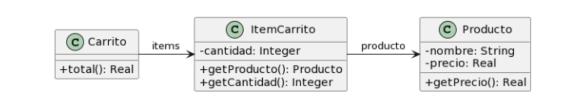
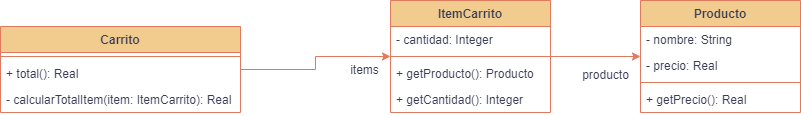
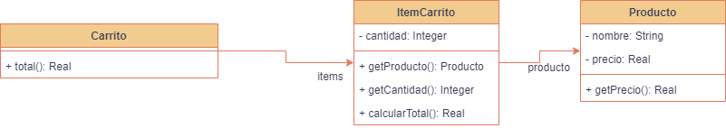

### 2.4 Carrito de compras


```java
public class Producto {
    private String nombre;
    private double precio;
    
    public double getPrecio() {
        return this.precio;
    }
}

public class ItemCarrito {
    private Producto producto;
    private int cantidad;
        
    public Producto getProducto() {
        return this.producto;
    }
    
    public int getCantidad() {
        return this.cantidad;
    }

}

public class Carrito {
    private List<ItemCarrito> items;
    
    public double total() {
return this.items.stream().mapToDouble(item -> item.getProducto().getPrecio() * item.getCantidad()).sum();
    }
}
```

1. **Mal Olor**: El método **"total()**" de la clase Carrito tiene un nivel de abstracción incorrecto. El método **"total()"** debería delegar la responsabilidad de calcular el total a la clase **"ItemCarrito"**. La responsabilidad esta mal asignada. (Feature Envy y Data Class)

2. **Refactoring**: Extract Method y Move Method

3. **Resultado**:

**Extract Method**:



```java
public class Carrito {
	private List<ItemCarrito> items;

	public double total() {
		return this.items.stream().mapToDouble(item -> calcularTotalItem(item)).sum();
	}

	private double calcularTotalItem(ItemCarrito item) {
		return item.getProducto().getPrecio() * item.getCantidad();
	}
}
```

**Move Method**:



```java
public class Carrito {
	private List<ItemCarrito> items;

	public double total() {
		return this.items.stream().mapToDouble(item -> item.calcularTotal()).sum();
	}

}

public class ItemCarrito {
    private Producto producto;
    private int cantidad;
        
    public Producto getProducto() {
        return this.producto;
    }
    
    public int getCantidad() {
        return this.cantidad;
    }
    
    public double calcularTotal() {
    	return this.producto.getPrecio() * this.cantidad;
    }
}
```