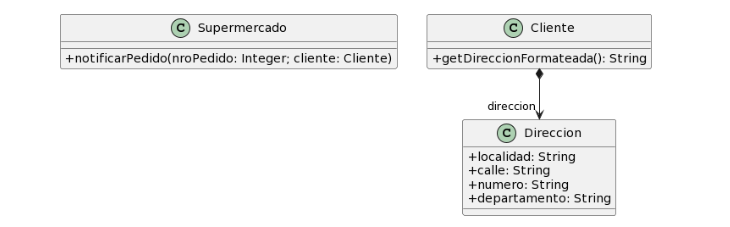
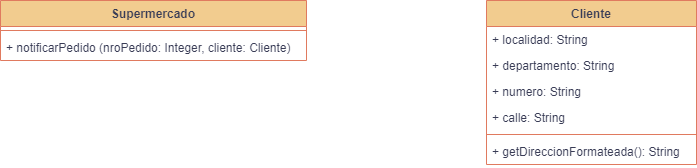

### 2.5 Envio De Pedidos



```java
public class Supermercado {
   public void notificarPedido(long nroPedido, Cliente cliente) {
     String notificacion = MessageFormat.format("Estimado cliente, se le informa que hemos recibido su pedido con número {0}, el cual será enviado a la dirección {1}", new Object[] { nroPedido, cliente.getDireccionFormateada() });

     // lo imprimimos en pantalla, podría ser un mail, SMS, etc..
    System.out.println(notificacion);
  }
}

public class Cliente {
   public String getDireccionFormateada() {
	return 
		this.direccion.getLocalidad() + ", " +
		this.direccion.getCalle() + ", " +
		this.direccion.getNumero() + ", " +
		this.direccion.getDepartamento()
      ;
}
```

1. **Mal Olor**: Inapropiate Intimacy, Feature Envy y Data Class. La clase Cliente usa demasiado de los atributos de la clase **"Direccion"** (que sin el cliente no existiría y lo único que hace es almacenar esos datos), por lo que se debería mover los atributos de la clase **"Direccion"** a la clase Cliente.

2. **Refactoring**: Move Field 

3. **Resultado**:



```java
public class Supermercado {
	public void notificarPedido(long nroPedido, Cliente cliente) {
		String notificacion = MessageFormat.format(
				"Estimado cliente, se le informa que hemos recibido su pedido con número {0}, el cual será enviado a la dirección {1}",
				new Object[] { nroPedido, cliente.getDireccionFormateada() });

		// lo imprimimos en pantalla, podría ser un mail, SMS, etc..
		System.out.println(notificacion);
	}
}

public class Cliente {
	public String localidad;
	public String calle;
	public String numero;
	public String departamento;

	public String getDireccionFormateada() {
		return this.localidad + ", " + this.calle + ", " + this.numero + ", " + this.departamento;
	}

}

```

1. **Mal Olor**: Declaración de atributo público. Los atributos **"localidad"**, **"calle"**, **"numero"** y **"departamento"** de la clase Cliente son públicos, por lo que se debería encapsularlos.

2. **Refactoring**: Encapsulate Field

3. **Resultado**: No se ponen los getters porque no se usan en ningún lado y esto a su vez podría generar un mal olor de Feature Envy e Inapropiate Intimacy.


```java
public class Supermercado {
	public void notificarPedido(long nroPedido, Cliente cliente) {
		String notificacion = MessageFormat.format(
				"Estimado cliente, se le informa que hemos recibido su pedido con número {0}, el cual será enviado a la dirección {1}",
				new Object[] { nroPedido, cliente.getDireccionFormateada() });

		// lo imprimimos en pantalla, podría ser un mail, SMS, etc..
		System.out.println(notificacion);
	}
}

public class Cliente {
	private String localidad;
	private String calle;
	private String numero;
	private String departamento;

	public String getDireccionFormateada() {
		return this.localidad + ", " + this.calle + ", " + this.numero + ", " + this.departamento;
	}

}
```
