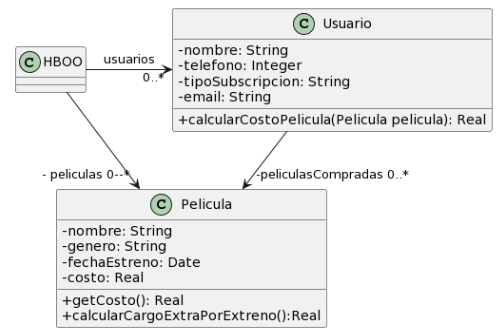
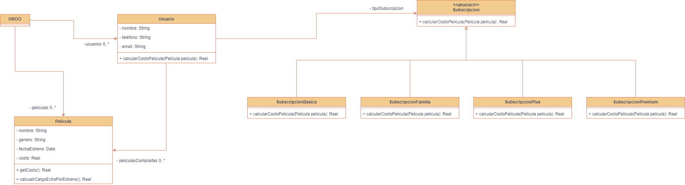

### 2.6 Películas



```java
public class Usuario {
    String tipoSubscripcion;
    // ...

    public void setTipoSubscripcion(String unTipo) {
   	 this.tipoSubscripcion = unTipo;
    }
    
    public double calcularCostoPelicula(Pelicula pelicula) {
   	 double costo = 0;
   	 if (tipoSubscripcion=="Basico") {
   		 costo = pelicula.getCosto() + pelicula.calcularCargoExtraPorEstreno();
   	 }
   	 else if (tipoSubscripcion== "Familia") {
   		 costo = (pelicula.getCosto() + pelicula.calcularCargoExtraPorEstreno()) * 0.90;
   	 }
   	 else if (tipoSubscripcion=="Plus") {
   		 costo = pelicula.getCosto();
   	 }
   	 else if (tipoSubscripcion=="Premium") {
   		 costo = pelicula.getCosto() * 0.75;
   	 }
   	 return costo;
    }
}

public class Pelicula {
    LocalDate fechaEstreno;
    // ...

    public double getCosto() {
   	 return this.costo;
    }
    
    public double calcularCargoExtraPorEstreno(){
	// Si la Película se estrenó 30 días antes de la fecha actual, retorna un cargo de 0$, caso contrario, retorna un cargo extra de 300$
   	return (ChronoUnit.DAYS.between(this.fechaEstreno, LocalDate.now()) ) > 30 ? 0 : 300;
    }
}
```

1. **Mal Olor**: El método **"calcularCostoPelicula()"** de la clase **"Usuario"** tiene un Switch Statement que podría ser reemplazado por Polimorfismo. (Switch Statements).

2. **Refactoring**: Replace Conditional Logic with Strategy (no se puede aplicar Replace Conditional Logic with Polymorphism porque no se pueden crear subclases ya que se puede cambiar de una subscripción a otra, usar Replace Conditional Logic with Polymorphism implicaría crear un objeto desde 0 si se cambia de subscripción).
   1. Crear una clase Strategy
   2. Aplicar “Move Method” para mover el cálculo con los
condicionales del contexto al strategy.
      1. Definir una v.i. en el contexto para referenciar al strategy y un setter (generalmente el constructor del contexto)
      2. Dejar un método en el contexto que delegue
      3. Elegir los parámetros necesarios para pasar al strategy (el contexto entero? Sólo algunas variables? Y en qué momento?)
      4. Compilar y testear.
   1. Aplicar “Extract Parameter” en el código del contexto que inicializa un strategy concreto, para permitir a los clientes settear el strategy. (Esto ya se tiene, lo unico que hay que hacer es cambiar el tipo del metodo setTipoSubscripcion() para que reciba una Subscripcion)
      1. Compilar y testear.
   2. Aplicar “Replace Conditional with Polymorphism” en el método del Strategy.
   3. Compilar y testear con distintas combinaciones de estrategias y contextos.

1. **Resultado**:
   

    
```java
public class Usuario {
	private Subscripcion tipoSubscripcion;
    // ...

	public void setTipoSubscripcion(Subscripcion unTipo) {
		this.tipoSubscripcion = unTipo;
	}

	public double calcularCostoPelicula(Pelicula pelicula) {
		return tipoSubscripcion.calcularCostoPelicula(pelicula);
	}
}

public abstract class Subscripcion {

	public abstract double calcularCostoPelicula(Pelicula pelicula);

}

public class SubscripcionBasica extends Subscripcion{
	
	public double calcularCostoPelicula(Pelicula pelicula) {
		return pelicula.getCosto() + pelicula.calcularCargoExtraPorEstreno();
	}

}

public class SubscripcionFamilia extends Subscripcion{

	public double calcularCostoPelicula(Pelicula pelicula) {
		return (pelicula.getCosto() + pelicula.calcularCargoExtraPorEstreno()) * 0.90;
	}

}

public class SubscripcionPlus extends Subscripcion{

	public double calcularCostoPelicula(Pelicula pelicula) {
		return pelicula.getCosto();
	}

}

public class SubscripcionPremium extends Subscripcion{

	public double calcularCostoPelicula(Pelicula pelicula) {
		return pelicula.getCosto() * 0.75;
	}

}

public class Pelicula {
	private LocalDate fechaEstreno;
    // ...

	public double getCosto() {
		return this.costo;
	}

	public double calcularCargoExtraPorEstreno() {
		// Si la Película se estrenó 30 días antes de la fecha actual, retorna un cargo
		// de 0$, caso contrario, retorna un cargo extra de 300$
		return (ChronoUnit.DAYS.between(this.fechaEstreno, LocalDate.now())) > 30 ? 0 : 300;
	}
}


```  


